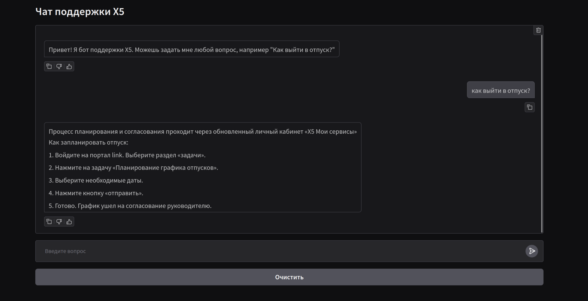

# Автоматизация первой линии технической поддержки

## Информация по кейсу

- Кейсодатель: X5 Group
- Кейсодержатель: Александр Потехин

## Разработчики

- [Алексей Безгин](https://github.com/elderberry17)
- [Алексей Ткаченко](https://github.com/da-the-dev/)
- [Вера Краснобаева](https://github.com/Vera-bahval)
- [Григорий Мацнев](https://github.com/pe51k)
- [Яков Марченков](https://github.com/RipYashok)

## Описание 

### Проблематика

Компании используют рудаментарных скриптовых ботов для автоматизации первой линии технической поддержки. Такой способ приводит к низкому качесту обработки запросов пользователей: по нашим подсчетам, в X5 **уходит в среднем 4 сообщения для решения 1 вопроса**.

### Последствия

- **Снижение производительности сотрудников:** Работники борются с поддержкой а не решают рабочие задачи.
- **Неоптимальная нагрузка на операторов:** Длинный сложный путь вынуждает пользователей обращаться сразу к оператору.

### Цель

Улучшить продуктивность сотрудников  и оптимизировать нагрузку на операторов 

### Гипотеза

***Возможно ли сократить число сообщений на решение вопроса с четырех до одного с высокой точностью?***

## Демо



[Питч дек](https://docs.google.com/presentation/d/13u_uFyIiNPq9zfIsR0k9h7TdQb-Igl1ggD3D6oNo4Rc/edit?usp=sharing)

## Запуск

### Docker 

1. Установить [Docker и Docker Compose](https://docs.docker.com/compose/)
2. Установить [NVIDIA Container Toolkit](https://docs.nvidia.com/datacenter/cloud-native/container-toolkit/latest/install-guide.html), если планируется использовать GPU для запуска VLLM
3. Скопировать файл `env/.env.example` в `env/.env` и заполнить переменные окружения. Тоже сделать для `env/.env.langfuse.example`. Пояснения к переменным можно найти в файле [`env/.env.example`](env/.env.example) и [`env/.env.langfuse.example`](env/.env.langfuse.example).
```
cp env/.env.docker.example env/.env
cp env/.env.langfuse.example env/.env.langfuse
```
4. Запустить приложение с помощью Docker Compose:
```
docker compose --env-file env/.env up -d
```

## Разработка: как начать

1. Настрить переменные окружения в `.env` (см. предыдущий раздел)
2. Установить [uv](https://docs.astral.sh/uv/getting-started/installation/)
3. Настроить python окружение:
```
uv sync
```

### Описание файлов
```
.
├── assets # Слайды и скриншоты
├── docker-compose.langfuse.yaml # Docker Compose файл для Langfuse
├── docker-compose.yaml # Docker Compose файл для запуска приложения
├── Dockerfile # Dockerfile для сборки приложения
├── env # Файлы с переменными окружения
├── pyproject.toml # Файл зависимостей проекта
├── README.md # Этот файл
├── scripts # Скрипты для обработка данных, обучения и оценки моделей
├── src # Исходный код приложения с FastAPI и Gradio
└── uv.lock # Файл блокировки uv для синхронизации зависимостей
```

Для расширенного понимания структуры проекта см. [README.md в src](src/README.md) и [README.md в scripts](scripts/README.md).
