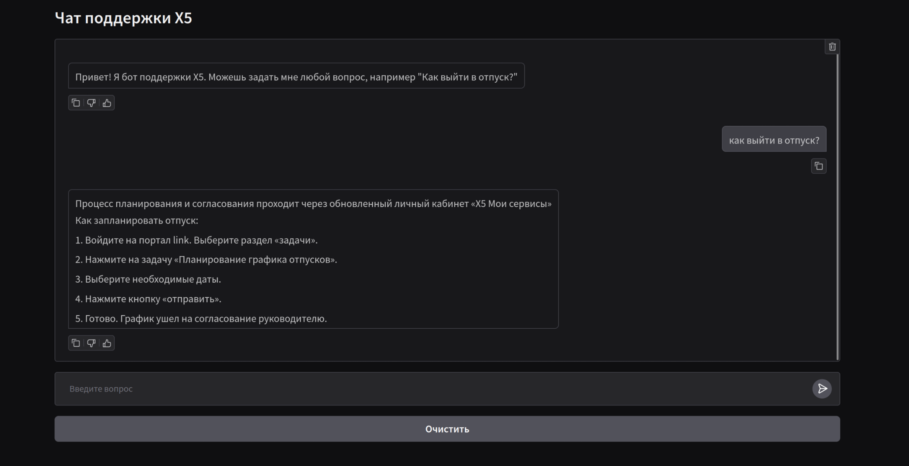

# Автоматизация первой линии технической поддержки
## Информация по кейсу
- Кейсодатель: X5 Group
- Кейсодержатель: Александр Потехин

## Разработчики
- [Алексей Безгин](https://github.com/elderberry17)
- [Алексей Ткаченко](https://github.com/da-the-dev/)
- [Вера Краснобаева](https://github.com/Vera-bahval)
- [Григорий Мацнев](https://github.com/pe51k)
- [Яков Марченков](https://github.com/RipYashok)

## Описание 
### Проблематика
Компании используют рудаментарных скриптовых ботов для автоматизации первой линии технической поддержки. Такой способ приводит к низкому качесту обработки запросов пользователей: по нашим подсчетам, в X5 **уходит в среднем 4 сообщения для решения 1 вопроса**.

### Последствия
- **Снижение производительности сотрудников:** Работники борются с поддержкой а не решают рабочие задачи.
- **Неоптимальная нагрузка на операторов:** Длинный сложный путь вынуждает пользователей обращаться сразу к оператору.

### Цель
Улучшить продуктивность сотрудников  и оптимизировать нагрузку на операторов 

### Гипотеза
***Возможно ли сократить число сообщений на решение вопроса с четырех до одного с высокой точностью?***


## Демо


[Питч дек](https://docs.google.com/presentation/d/13u_uFyIiNPq9zfIsR0k9h7TdQb-Igl1ggD3D6oNo4Rc/edit?usp=sharing)


## Запуск
### Docker 
```
docker compose up -d
```

## Разработка: как начать
- [uv](https://docs.astral.sh/uv/getting-started/installation/)
- С установленным uv
```
uv sync
```

### Описания к файлам и директориям
```
├── src/            # Исходный код
├── base_up/        # Скрипты для сида базы знаний qdrant
├── scripts/        # Служебные скрипты
├── docs/           # Картинки для README.md
└── .env.example    # Стартовый .env  
```