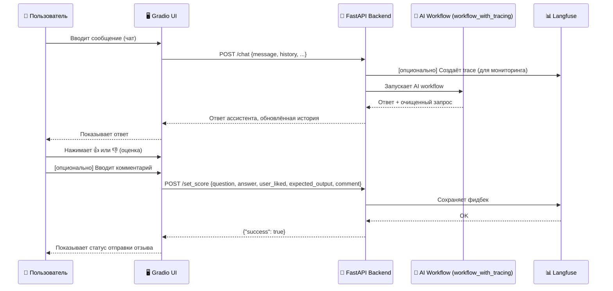

# Src

Данный каталог содержит основной исходный код проекта автоматизации технической поддержки X5.

## Обзор файлов
```
.
├── ai                  # Модуль AI-логики и обработки запросов
│   ├── __init__.py
│   ├── retrieval       # Векторный поиск, работа с эмбеддингами и управление векторной базой данных
│   │   ├── __init__.py
│   │   └── resources   # Данные для инициализации векторной базы данных
│   │       ├── embeddings.pt
│   │       └── qa_df_pairs_db.csv
│   ├── workflow_events.py      # Набор Event-ов для workflow (определяют поведение на разных этапах)
│   ├── workflow.py             # Основная логика workflow
│   ├── workflow_steps          # Отдельные шаги workflow
│   │   ├── deduplicate.py
│   │   ├── __init__.py
│   │   ├── preprocess.py
│   │   ├── qa_examples.py
│   │   ├── reply.py
│   │   ├── retrieve.py
│   │   └── sanity_check.py
│   └── workflow_with_tracing.py # Workflow с LangFuse трассировкой
├── api                 # FastAPI приложение
│   ├── __init__.py
│   └── models.py
├── app_with_gradio.py  # Gradio UI, монтированное с FastAPI приложением
├── README.md
├── settings.py         # Конфигурация через Pydantic Settings
└── ui                  # Gradio UI
    └── __init__.py
```

## Описание API-эндпоинтов
```json
[
  {
    "method": "GET",
    "path": "/",
    "description": "Корневой эндпоинт API. Возвращает информацию о сервисе.",
    "response": {
      "message": "X5 Technical Support API",
      "version": "1.0.0"
    }
  },
  {
    "method": "GET",
    "path": "/health",
    "description": "Проверка состояния сервиса.",
    "response": {
      "status": "healthy",
      "message": "X5 Technical Support API is running"
    }
  },
  {
    "method": "POST",
    "path": "/chat",
    "description": "Обработка пользовательского сообщения и генерация ответа ассистента.",
    "request": {
      "message": "string (вопрос пользователя)",
      "history": "[ChatMessage] (опционально)",
      "clear_history": "[ChatMessage] (опционально)",
      "session_id": "string (опционально)",
      "user_id": "string (опционально)"
    },
    "response": {
      "response": "string (ответ ассистента)",
      "clear_query": "string (очищенный запрос)",
      "history": "[ChatMessage] (обновленная история)",
      "clear_history": "[ChatMessage] (обновленная очищенная история)"
    }
  },
  {
    "method": "POST",
    "path": "/set_score",
    "description": "Отправка пользовательской оценки/отзыва для улучшения модели.",
    "request": {
      "score_name": "string (по умолчанию 'user-feedback')",
      "question": "string (оригинальный вопрос)",
      "answer": "string (ответ ассистента)",
      "user_liked": "bool (лайк/дизлайк)",
      "expected_output": "string (ожидаемый ответ, опционально)",
      "comment": "string (комментарий, опционально)"
    },
    "response": {
      "success": "bool",
      "message": "string (опционально)",
      "error": "string (опционально)"
    }
  }
]
```

## Cхема работы Gradio


## Описание llama_index workflow
```mermaid
graph TD
    Q[Входящий запрос пользователя] --> P[Preprocess (очистка запроса)]
    P --> R[Retrieve (поиск релевантных Q&A)]
    R --> D[Deduplicate (удаление дубликатов Q&A)]
    D --> S[SanityCheck (проверка найденных Q&A на релевантность запросу)]
    S --> E{Есть валидные примеры?}
    E -- Да --> G[Reply (генерация ответа)]
    E -- Нет --> X[Stop (нет ответа)]
    G --> O[Ответ пользователю]
    X --> O
```
